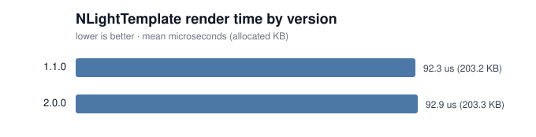

# Render performance by version

Generated 2026-07-29 (UTC). Lower is better. Numbers reflect the machine that produced them, so treat the version-over-version comparison as the signal, not the absolute values.

| Version | Mean | vs oldest | Allocated |
|---------|------|-----------|-----------|
| 1.1.0 | 232.4 us | 1.00x | 203.2 KB |
| 2.0.0 | 238.6 us | 1.03x | 203.1 KB |
| 2.1.0 | 220.2 us | 0.95x | 197.0 KB |

